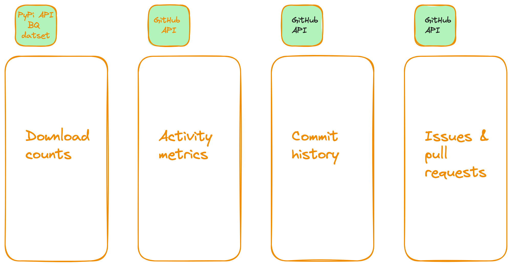

# Tracking Trends in Python Package Usage and Repository Development

## Description
In today's data-rich environment, selecting the right datasets for analysis can be challenging. This project focuses on datasets from PyPI and the GitHub API, which will be stored, processed, and analyzed in a data warehouse. The objective is to build a robust pipeline to support an analytics framework capable of tracking trends in Python package usage and repository development. The analysis will cover the frequency of package downloads over time, version adoption rates, and user engagement metrics on PyPI, as well as repository activity metrics such as commit frequency, issue resolution times, and contributor trends on GitHub.

## Problem Description
Although GitHub and PyPI provide statistics about users' or organizations' repositories and Python packages, they lack comparative analysis across similar repositories and packages. For developers, maintainers, and stakeholders in the Python community, this project will help identify popular packages, active repositories, and overall trends in open source contributions. This data-driven approach will enhance decision-making processes, support better resource allocation, and foster a deeper understanding of the Python programming landscape.

## Conceptual Model
The primary datasets and APIs that will be used are the PyPI dataset from Google BigQuery and the GitHub API. This model will integrate data from these sources to provide comprehensive insights into Python package usage and repository development.

