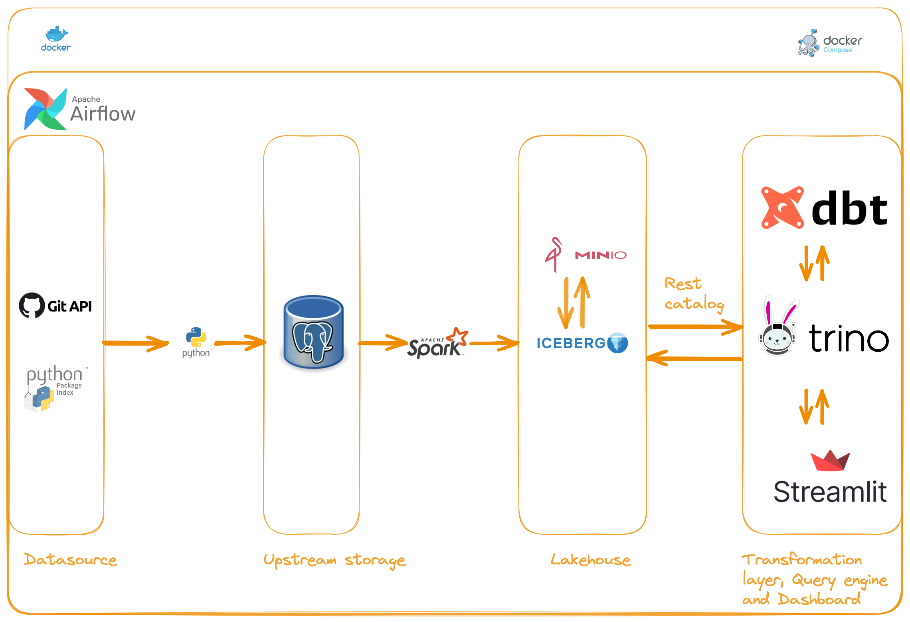

[](https://classroom.github.com/a/1lXY_Wlg)

# Tracking Trends in Python Package Usage and Repository Development

## Description
In today's data-rich environment, selecting the right datasets for analysis can be challenging. This project focuses on datasets from PyPI and the GitHub API, which will be stored, processed, and analyzed in a data warehouse. The objective is to build a robust pipeline to support an analytics framework capable of tracking trends in Python package usage and repository development. The analysis will cover the frequency of package downloads over time, version adoption rates, and user engagement metrics on PyPI, as well as repository activity metrics such as commit frequency, issue resolution times, and contributor trends on GitHub.

## Problem Description
Although GitHub and PyPI provide statistics about users' or organizations' repositories and Python packages, they lack comparative analysis across similar repositories and packages. For developers, maintainers, and stakeholders in the Python community, this project will help identify popular packages, active repositories, and overall trends in open source contributions. This data-driven approach will enhance decision-making processes, support better resource allocation, and foster a deeper understanding of the Python programming landscape.

## Motivation
As the bootcamp covered various tools and technologies, I became curious about the popularity of Lakehouses in terms of repository development and usage. GitHub was used throughout the bootcamp for both independent and collaborative work. Naturally, I relied on GitHub as the primary source for the data. Additionally, I supplemented it with data from the PyPi package repository to understand the popularity of Python-related lakehouse packages in the big data ecosystem.

## Goal
My goal for this capstone is two fold:
1. Incorporate the various tools and technologies used in the bootcamp.
2. Build an end-to-end reproducible data pipeline using Docker and Docker Compose.

## Conceptual Model
The primary datasets and APIs that will be used are the PyPI dataset from Google BigQuery and the GitHub API. This model will integrate data from these sources to provide comprehensive insights into Python package usage and repository development.


# High-level architecture


# dbt Documentation
[View DBT Docs](https://sl2902.github.io/target/index.html)


# Datasource
The source of the data is GitHub Rest APIs and PyPi API. The following APIs are used:

- /repos/{owner}/{repo}/commits - List commits. Can query 5000 responses per hour
- /repos/{owner}/{repo}/issues - List issues in a repository. Only open issues will be listed. Can query 5000 responses per hour
- /repos/{owner}/{repo}/ - List summary statistics for a repository every day
- https://pypistats.org/api/packages/{package}/overall - Last 6 months history for a package. Updates daily

# Metrics and Dashboard

Three repos were analyzed: Apache Iceberg, Apache Hudi and Delta-io Delta. For PyPi last 6 months package downloads were analyzed.
<details>
<summary>Summary statistics for repos</summary>

- Provides a snapshot for various repository metrics such as fork_count, size, watchers_count, stargazers_count and subscribers_count


</details>

<details>
<summary>Commits metrics</summary>
- A line chart comparing the three repositories by number of commits by authors for all time


- A line chart comparing the three repositories by number of commits by commiters for all time.

Note - Here the charts are almost identical as the commit_author_date nd commit_committer_date are identical when
the commiter is GitHub


</details>

<details>
<summary>Issues metrics</summary>

- A line chart comparing the frequency of issues over time across the three repositories


- A line chart showing the cumulative count of issues in the last 7 days


- A line chart showing the number of days taken to update an issue


</details>

<details>
<summary>PyPi packages metrics</summary>

- A line chart showing the percentage change in pyiceberg downloads - last 6 months


- A line chart showing the percentage change in delta-spark downloads - last 6 months


</details>

# Dag dependencies


# End to end pipeline flow
Each pipeline corresponds to an end-to-end flow for a given GitHub REST API endpoint, making it easier to test and debug. Additionally, it helps with any future backfill and allows the DAGs to be independently scheduled. The DAGs are externally triggered.
The upstream tables are created when the Docker container is up and running

`gh_rest_pypi_overall_api`: This DAG fetches data from the PyPi API. Currently, the API provides data for the last 6 months.<br>
`trigger_spark_pypi_history_transfer`: This DAG triggers the downstream DAG upon successful completion of the upstream task.<br>
`publish_pg_raw_overall_to_iceberg`: This DAG reads data from the upstream table in PostgreSQL and writes it into a partitioned table in Iceberg, partitioned by load_date.<br>
`trigger_dbt_pypi_history_model`: This DAG triggers the downstream DAG upon successful completion of the upstream task.<br>
`pypi_app_overall_models`: This DAG builds and transforms the data in Trino using dbt. The bronze layer contains the raw data. Some standard data quality checks are performed, such as checking for freshness. The primary key is tested for uniqueness and not null. The incremental merge strategy is used in the bronze layer to ensure not all the data is loaded every time the models are run.<br>

Note - While the upstream data and spark logs are persisted between Docker restarts, I ran into some unknown issue trying to persist the lakehouse data.


# URLs and port numbers
| Service Name       | URL                   | Port | User   | Password |
|--------------------|-----------------------|------| -------|----------|
| Spark Master       | http://localhost:4040 | 4040 |        |          |
| Spark History      | http://localhost:18080| 18080|        |          |
| MinIO              | http://localhost:9000 | 9000 | minio  | minio123 |
| Airflow Webserver  | http://localhost:8080 | 8080 | airflow| airflow  |
| Trino              | http://localhost:1080 | 1080 | admin  |          |
| Streamlit          | http://localhost:8501 | 8501 |        |          |


# Steps to reproduce
**1.** Prerequisites:

<details>
<summary>Install Git for your OS</summary>
Installation instructions [here](https://git-scm.com/downloads)

You will need your Personal Access Token (PAT). For this, got the following page
and generate your PAT. Grant it the appropriate persmissions

[Generate PAT](https://github.com/settings/tokens)
</details>

Note - If you have already done these steps then it is not required. However, you will need the Personal Access Token (PAT)

<details>
<summary>Install Docker for your OS</summary>

Installation instructions[here](https://docs.docker.com/engine/install/)

Note - If you have already done these steps then it is not required.
</details>

**2.** Clone the repository:
```shell
git clone https://github.com/DataExpert-ZachWilson-V4/capstone-project-sundeep.git
```

**3.** Change the working directory:
```shell
cd capstone-project-sundeep/
```

**4.** Rename the env.template file to `.env`:
```shell
mv env.template .env
```

4.1 Fill in the blanks to the following environment variables in the `.env` file and save them:
```shell
GIT_PAT=
```

**5.** Load environment variables into the project directory:
```shell
source .env
```

**6.** Build Docker images:
```shell
make docker_build
```

6.1 Start Docker containers:
```shell
make docker_up
```

**7.** Create SSH connection for Spark job:
```shell
make ssh_conn
```

7.1 Run `base_repo` pipeline:
```shell
make dag_run_base_repo_pipeline
```

7.2 Run `commits` pipeline:
```shell
make dag_run_commits_pipeline
```

7.3 Run `issues` pipeline:
```shell
make dag_run_issues_pipeline
```

7.4 Run `overall` pipeline:
```shell
make dag_run_overall_pipeline
```

7.5 Launch Streamlit dashboard:
```shell
 http://localhost:8501
 ```

> [!NOTE]
> If the dashboard is not updated, then stop and start the container:
> ```shell
> docker compose down streamlit
> docker compose up -d streamlit
> ```

# Next steps

[1] Add unit tests and integration tests<br>
[2] Add CI/CD pipeline<br>
[3] Move to the cloud<br>

# References
[1] [Airflow docker](https://airflow.apache.org/docs/apache-airflow/stable/howto/docker-compose/index.html)<br>
[2] [Iceberg-Spark container](https://iceberg.apache.org/spark-quickstart/#spark-and-iceberg-quickstart)<br>
[3] [Create Kafka topic on startup](https://stackoverflow.com/questions/64865361/docker-compose-create-kafka-topics)<br>
[4] [Fix for Kafka listeners](https://github.com/borgesnotes/kafka-docker/blob/master/confluent/docker-compose.yml)<br>
[5] [Persist postgres data in Docker](https://stackoverflow.com/questions/41637505/)<br>
[6] [Airflow SSH operator setup](https://github.com/anittasaju1996/MyProjects/blob/master/Airflow_SSHOperator_Spark_in_Docker/spark.Dockerfile)<br>
[7] [Iceberg DNS error fix](https://github.com/apache/iceberg/issues/7721)<br>
[8] [Trino-Iceberg-Minio Docker](https://github.com/bitsondatadev/trino-getting-started)<br>
[9] [Rest catalog DNS error fix](https://github.com/apache/iceberg/issues/7709)<br>
[10] [GitHub Rest API](https://docs.github.com/en/rest?apiVersion=2022-11-28)<br>
[11] [PyPi API](https://pypistats.org/)<br>


